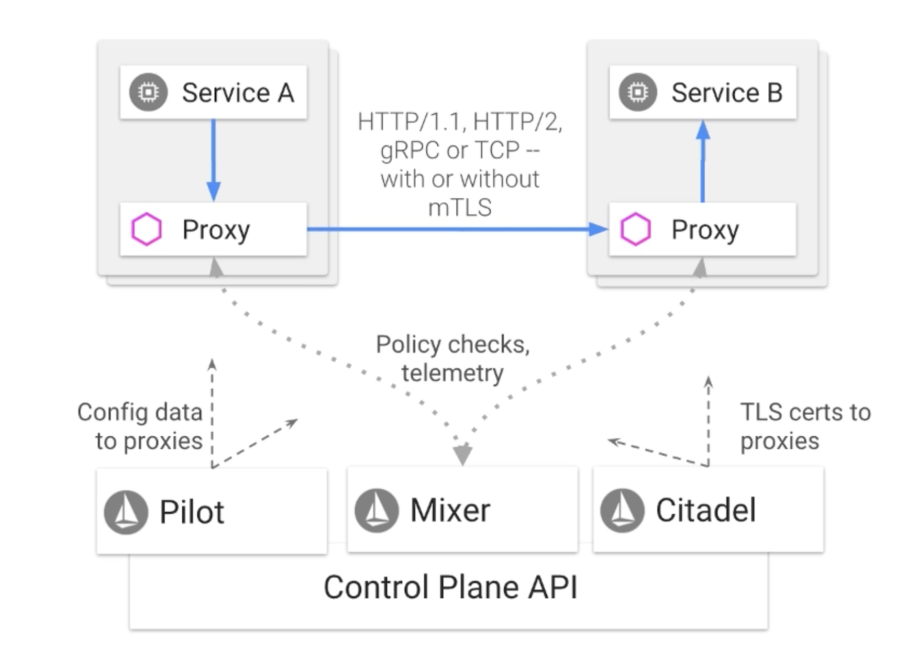

* Traffic between services goes through the proxies(sidecar proxy container: envoy)
* Pilot is responsible for syncing configurations to proxies
* Mixer collects telemetries and applies policies
* Citadel does certificate jobs(generating, renewing, encrypt-decrypt...etc.)